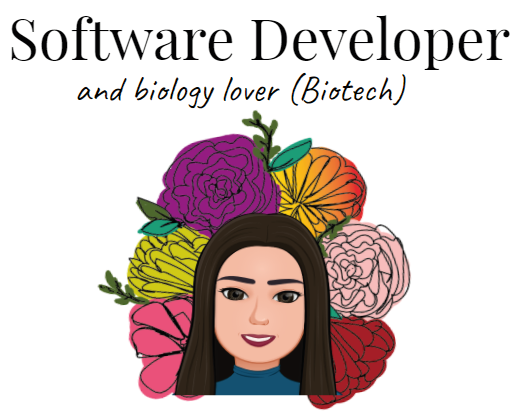

# Hi, I'm Estefanie :hibiscus:

Full Stack Developer and Biology lover.
Passionate about life sciences, scientific research and a strong believer that DNA is the perfect molecule, this student has recently found a new passion by delving into the field of Web development. Acquiring knowledge in FrontEnd (HTML, CSS and Javascript) and BackEnd (PHP and frameworks like Laravel) I have considered new projects, implementing good development practices and clean architecture. Currently experimenting with new technologies to achieve the successful implementation of an efficient and scalable code.

My goal is to merge my two passions to seek new job opportunities that allow me to expand my knowledge and undertake new challenges since hunger and thirst for knowledge is one of the things that motivates me the most in life.

### Find me around the web :globe_with_meridians:
- Linkeding : www.linkedin.com/in/estefanie-garcia
